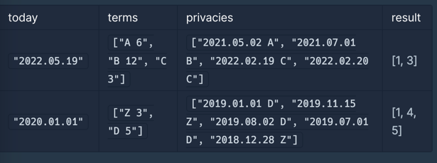

## 개인정보 수집 유효기간 - Lv.1

https://school.programmers.co.kr/learn/courses/30/lessons/150370?language=javascript

### 나의 풀이
날짜를 어떻게 구할 수 있는지에 대한 아이디어가 없음.<br />


### 다른 사람 풀이

```javascript
function solution(today, terms, privacies) {
    var answer = [];
    var [year, month, date] = today.split(".").map(Number);
    var todates = year * 12 * 28 + month * 28 + date;
    var t = {};
    terms.forEach((e) => {
        let [a, b] = e.split(" ");
        t[a] = Number(b);
    });
    privacies.forEach((e, i) => {
        var [day, term] = e.split(" ");
        day = day.split(".").map(Number);
        var dates = day[0] * 12 * 28 + day[1] * 28 + day[2] + t[term] * 28;
        if (dates <= todates) answer.push(i + 1);
    });
    return answer;
}
```

### 배운 점
1. 날짜를 숫자로 바꾸는 아이디어를 떠올리면 된다!
Timestamp처럼 날짜를 숫자로 변경하여 그 숫자끼리 비교하면 뭐가 더 큰지 알수 있다.
- 연도 : year * 12 * 28
- 월 : month * 12
- 일 : day 

2. `Array.map(Number)`을 통해 문자열 -> 숫자 변환 가능하다.
```javascript
const arr = ['1','2','3'];

console.log(arr.map(item => Number(item))) // [1,2,3]
console.log(arr.map(Number)) // [1,2,3]
```


